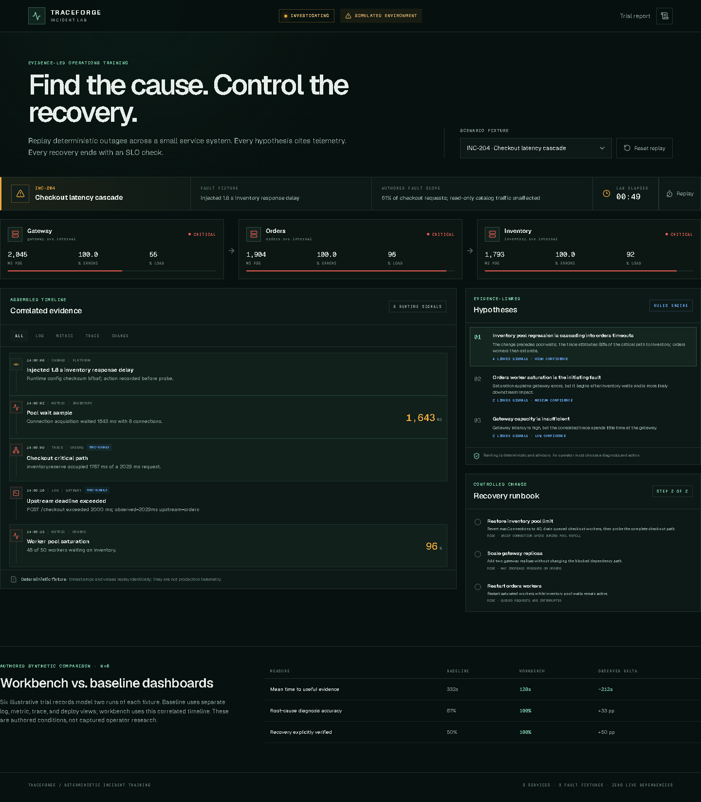

# Traceforge Incident Lab

[Live production lab](https://traceforge-incident-lab.vercel.app) · [Architecture](docs/ARCHITECTURE.md) · [Runbooks](docs/RUNBOOKS.md) · [Synthetic trial method](docs/BENCHMARK.md)

Traceforge is a deterministic incident investigation and controlled recovery workbench. It lets an operator inject one of three known failures into a small simulated service system, assemble correlated telemetry, test evidence-linked hypotheses, choose an explicit runbook action, and verify whether the service-level objective recovered.

> **Scope:** Every service, fault, log, metric, trace, deploy event, and trial result in this repository is simulated. Traceforge is a portfolio and training product, not evidence of production incident response or a connection to live infrastructure.



## Product tour

The lab models `gateway → orders → inventory` and includes:

- latency cascade from an inventory connection-pool regression;
- an orders deploy with a stale dependency endpoint;
- queue saturation caused by synchronized retries;
- logs, metrics, traces/correlation IDs, change events, and one assembled timeline;
- ranked hypotheses whose claims link only to visible evidence;
- controlled runbook choices, including realistic wrong actions that do not recover;
- explicit post-action verification gates and an immutable in-session audit trail;
- replayable fixtures with stable timestamps and values;
- a small, clearly qualified synthetic comparison against separate baseline dashboards.

No AI API or secret is required. The hypothesis ranking is a transparent deterministic rules fixture. It is advisory and cannot remediate automatically.

## Requirement-to-evidence matrix

| Requirement | Implementation evidence | Automated/public proof |
|---|---|---|
| Executing service system | `lib/runtime.ts` runs gateway → orders → inventory/tax functions from transaction input and config | Unit test changes order ID/item count and asserts different runtime telemetry |
| Correlated observability | Runtime recorder emits logs, metrics, traces, changes, and one propagated correlation ID | Inject any fault; filter the assembled timeline by signal type |
| Evidence-linked diagnosis | Hypotheses refer to IDs emitted by the transaction, not hidden narrative | Contract test resolves every link against a fresh fault run |
| Controlled recovery | Runbook actions mutate runtime config; no action has a stored correctness flag | Browser test selects, stages, and executes a runbook action |
| Wrong-action non-recovery | Every action triggers a fresh checkout probe; unresolved causal config fails its computed SLO | Unit + browser tests scale gateway during a dependency cascade and observe failure |
| Verified recovery | Fresh probe must succeed under 400 ms before phase becomes recovered | Complete the first action for any fixture and inspect the new health transaction |
| Replay and audit | Reducer provides explicit reset and append-only in-session audit events | Scenario-switch E2E and reducer reset/audit tests |
| Baseline comparison | Six raw, disclosed synthetic observations and computed summary | `docs/BENCHMARK.md` and the trial report on the public page |
| Release quality | Zero-secret configuration, pinned runtime, CI quality/browser jobs, exact public alias verification | `.github/workflows/ci.yml`, `scripts/secret-scan.mjs`, repository Actions, and deployed Playwright run |

Release proof: the exact production alias `https://traceforge-incident-lab.vercel.app` returned HTTP 200, exposed the three-scenario simulated API contract, and passed the four-flow Chromium suite after deployment on 2026-09-04.

## Run locally

```bash
npm install
npm run dev
```

Open `http://localhost:3000`. The scenario catalog is also available as a typed read-only endpoint at `GET /api/scenarios`.

## Verification

```bash
npm run lint
npm run typecheck
npm run test
npm run build
npx playwright install chromium
npm run test:e2e
npm run scan:secrets
```

The unit suite validates deterministic transitions, unresolved recovery after a wrong action, successful recovery for all fixtures, audit behavior, evidence-link integrity, unique root causes/actions, telemetry coverage, benchmark calculations, and the public API response. Browser tests exercise both the correct and incorrect recovery paths.

## Synthetic trial report

Conditions: six authored synthetic records covering three fixed fixtures twice (`n=6`) under deterministic telemetry. They illustrate the product's defined measurement method; they are not captured user-study observations. The baseline condition represents four separate dashboard views; the workbench condition uses Traceforge's assembled timeline.

| Measure | Baseline | Workbench |
|---|---:|---:|
| Mean time to useful evidence | 332 s | 120 s |
| Root-cause diagnosis accuracy | 67% | 100% |
| Recovery explicitly verified | 50% | 100% |

These are descriptive authored fixture values. No human timing was captured, and six synthetic records cannot support claims about operator performance or production incidents. See [docs/BENCHMARK.md](docs/BENCHMARK.md).

## Design notes

- [Architecture](docs/ARCHITECTURE.md)
- [ADR 001: deterministic client-side state machine](docs/adr/001-deterministic-state-machine.md)
- [Runbooks](docs/RUNBOOKS.md)
- [Trial method and raw observations](docs/BENCHMARK.md)

## Acknowledgements

The product direction is informed by the [OpenTelemetry Demo failure scenarios](https://opentelemetry.io/docs/demo/) and general OpenTelemetry concepts. Traceforge does not copy or run the OpenTelemetry Demo; its fixtures, contracts, interface, and investigation logic are original to this repository.

## License

MIT
